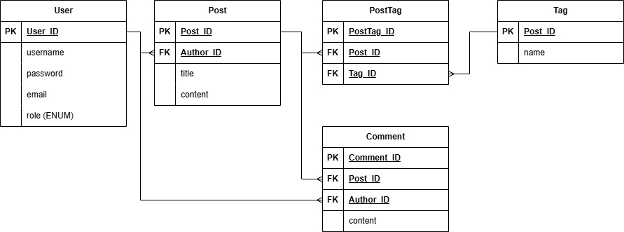

# 게시판
* Java, Spring, React 숙련도 향상을 위해 진행한 게시판 생성 프로젝트입니다.

 

## 기능
1. **회원가입 / 로그인 / 로그아웃**
    * 회원가입, 로그인 기능을 Spring Security 프레임워크를 활용해 보안 기능 구현
    * JWT 구현 및 로그인 후 회원 이용 가능한 페이지에서 사용자 인증 관리
    * LocalStorage, store 활용한 데이터 저장
2. **에러 핸들링**
   * 각 에러 코드에 따른 응답 구현

 

## Wireframe
